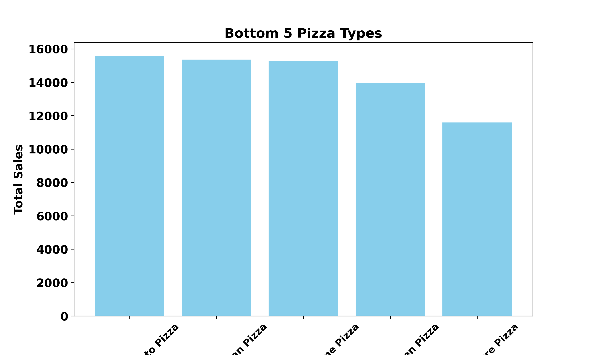

# Pizza-Sales-Analysis-Report-
Which pizzas sell the most, when, and why? A Python analysis of sales patterns and customer behavior
# Introduction

This project analyzes one year of sales data from a fictitious pizza restaurant to uncover key business insights and sales trends. The dataset contains detailed information about each order, including the date and time, pizza type, size, quantity, price, and ingredients. The data was originally provided in four separate tables: Orders, Order Details, Pizzas, and Pizza Types, which were merged into a single dataset to enable comprehensive analysis.

# Dataset Overview

The dataset contains 48,620 pizza sales records, where each row represents a pizza purchased in an order.

## Important Columns Used for Analysis

| Column Name | Description | Purpose in Analysis |
|-------------|-------------|---------------------|
| order_id | Unique identifier for each order | Used to calculate total number of orders |
| date | Date when the order was placed | Used for daily, weekly, and monthly sales trend analysis |
| Hours | Hour when the order was placed | Used to identify peak sales hours |
| name | Name of the pizza | Used to identify best-selling and underperforming pizzas |
| category | Category of the pizza (Classic, Chicken, Supreme, Veggie) | Used to compare category performance |
| size | Size of the pizza (Small, Medium, Large) | Used to determine which size generates the most revenue |
| quantity | Number of pizzas sold | Used to measure customer demand |
| price | Price per pizza | Used to calculate total revenue |

## Data Cleaning Process

Before analysis, the dataset was cleaned and prepared to ensure accuracy, consistency, and reliability.

### Cleaning Steps Performed

| Step | Action Taken | Purpose |
|------|--------------|---------|
| Checked for missing values | Verified all columns had complete records | Ensured no incorrect analysis due to null values |
| Verified data types | Converted `date` to datetime format and ensured `price` was float | Enabled proper time series and revenue analysis |
| Created Hour column | Extracted hour from order time | Used to identify peak sales hours |
| Merged datasets | Combined Orders, Order Details, Pizzas, and Pizza Types tables | Created a single dataset for full analysis |
| Checked duplicates | Ensured no duplicate transactions | Prevented double counting of revenue |
| Created Revenue column | Calculated Revenue = Quantity × Price | Used to measure total sales performance |
| Renamed columns | Standardized column names for clarity | Improved readability and analysis workflow |
### Final Dataset Summary

- Total Records: **48,620**
- Total Columns: **13**
- No Missing Values
- No Duplicate Records
- Data Types Correctly Formatted

### Why Data Cleaning Is Important

Data cleaning ensures that the analysis results are:

- Accurate  
- Reliable  
- Free from errors  
- Ready for business decision-making  

Without cleaning, the insights and conclusions would be incorrect.

# Dashboard Overview

# Pizza Place Sales Analysis: Key Metrics Overview

Over the course of one year, the pizza restaurant generated a total revenue of $817,860 from 21,350 orders, selling 49,574 pizzas in total. This demonstrates a steady stream of customers and strong overall demand.

The restaurant offers 32 different pizza types, giving customers a wide variety of choices, with an average price per pizza that reflects the balance between affordability and premium options. These figures set the stage for a deeper look into customer preferences, peak sales periods, and which pizzas are driving the most revenue.

# Sales Patterns Over Time
## Weekly Sales Overview

Peak Days: Friday (136,074), Thursday (123,529), Saturday (123,182). highest customer demand.

Low Days: Monday (107,330) and Sunday (99,204). slower sales periods.

**Insight:** Focus operational efforts and promotions on Thursday through Saturday to maximize revenue. Slower days can be used for preparation, staff training, or targeted marketing campaigns.

## Peak and Off-Peak Sales Hours

Peak Sales Hours: 12 PM – 1 PM (111,877 – 106,065 orders) and 5 PM – 6 PM (86,237 – 89,296 orders), corresponding to lunch and dinner periods when customer demand is highest.

Moderate Sales Hours: 2 PM – 4 PM and 7 PM – 8 PM, with steady but lower order volumes.

Off-Peak Hours: 9 AM – 10 AM and late night (11 PM), showing minimal activity.

Professional Insight: Pizza sales are strongest during traditional meal times, reflecting typical customer ordering behavior around lunch and dinner. Focusing operations on these peak hours ensures efficient staffing, timely delivery, and optimized kitchen management. Off-peak hours provide opportunities for preparation, maintenance, or targeted promotions to improve overall performance.

# Product Performance
## Top 5 Best-Selling Pizzas

Thai Chicken Pizza:₦43,434.25

Barbecue Chicken Pizza: ₦42,768.00

California Chicken Pizza: ₦41,409.50

Classic Deluxe Pizza: ₦38,180.50

Spicy Italian Pizza: ₦34,831.25

Insight: While these five pizza varieties are the top sellers, they contribute only about 24% of total revenue, indicating that sales are well-distributed across a wide range of menu items. Targeted marketing and promotions for these popular items can still boost revenue, but broad operational strategies should consider the full menu to maximize overall performance.

## Underperforming pizza types

Some pizzas are selling much less than others. The Brie Carre Pizza ($13,955.75), Spinach Supreme Pizza ($15,360.50), and Spinach Pesto Pizza ($15,596.00) generated the lowest revenue, showing that customers prefer meat-based or classic pizzas. The Brie Carre, being the weakest performer, may need better promotion, a price adjustment, or reconsideration on the menu to boost sales.

## Best performimg category 

## what pizza size generated the highest revenue ?

## Pizza Category Performance & Size Insights

| Category | Total Revenue (₦) | Contribution from Key Pizzas (%) | Size Driving Revenue |
|----------|-----------------|-------------------------------|--------------------|
| Classic  | 220,053         | ~45%                           | Large pizzas dominate |
| Supreme  | 208,197         | ~47%                           | Large pizzas dominate |
| Chicken  | 195,920         | ~67%                           | Large pizzas dominate |
| Veggie   | 193,690         | ~50%                           | Large pizzas dominate |

### Insights
- **Revenue concentration:** A few top pizzas generate 40–70% of each category’s total revenue.  
- **Large sizes dominate revenue** due to higher prices and group consumption preference.  
- Classic leads because of a **balance of high-revenue and mid-range pizzas**.  
- Supreme and Chicken rely heavily on **top performers**, while Veggie provides **menu variety**.  
- Use these insights to guide **inventory, promotions, and menu optimization**.
Insights:

# Trend Analysis
## Monthly Sales Overview

Peak Months: May (₦71,402.75) and July (₦72,557.90), driving Q2 as the strongest quarter (₦208,369.75).

Lowest Months: September (₦64,180.05) and October (₦64,027.60), making Q4 the weakest quarter (₦199,124.10).

Moderate Quarters: Q1: ₦205,350.00, Q3:₦205,993.10, showing consistent activity.

**Insight:** Slight monthly fluctuations indicate steady demand. Focus marketing and inventory strategies on peak months, while targeting slower months with promotions to smooth seasonal dips.

## Conclusion & Recommendations

**Conclusion:**
The pizza sales analysis shows that a small number of pizzas drive **40–70% of category revenue**, with **Classic leading overall** due to a balance of top-performing and mid-range items. **Large pizzas consistently dominate revenue**, reflecting customer preference for shared meals and higher-priced options. Meat-based and traditional pizzas outperform vegetable-based varieties, while sales peak during **lunch and dinner hours, on Thursdays–Saturdays, and in May–July**. Monthly and weekly trends reveal steady demand with moderate fluctuations, and underperforming pizzas indicate opportunities for menu optimization.

**Recommendations:**

1. **Focus on top performers and large sizes** for promotions, upselling, and inventory planning to maximize revenue.
2. **Review or promote underperforming pizzas** (especially vegetable-based) to align with customer preferences.
3. **Optimize operations during peak hours and days** to ensure efficient staffing, timely delivery, and customer satisfaction.
4. **Leverage seasonal trends**: target marketing and inventory planning for peak months while using promotions to boost slower months.
5. Maintain menu variety with Veggie pizzas for niche audiences, but prioritize revenue-driving categories like Classic, Supreme, and Chicken.

**Overall:** Strategic focus on **top pizzas, large sizes, peak sales periods, and category strengths**, combined with targeted promotion and menu management, will improve revenue, customer satisfaction, and operational efficiency.

