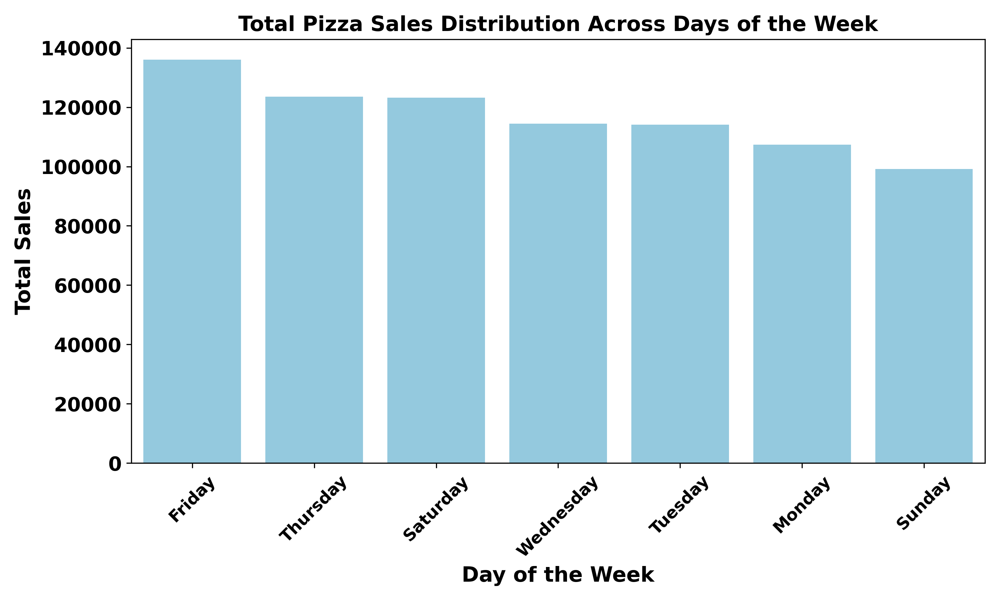
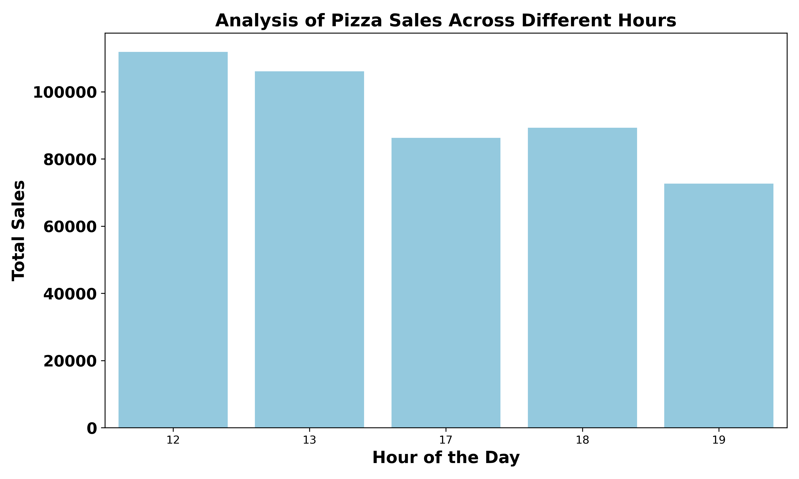

# Pizza-Sales-Analysis-Report-
Which pizzas sell the most, when, and why? A Python analysis of sales patterns and customer behavior
# Introduction

This project analyzes one year of sales data from a fictitious pizza restaurant to uncover key business insights and sales trends. The dataset contains detailed information about each order, including the date and time, pizza type, size, quantity, price, and ingredients. The data was originally provided in four separate tables: Orders, Order Details, Pizzas, and Pizza Types, which were merged into a single dataset to enable comprehensive analysis.

The goal of this project is to understand customer purchasing behavior, identify the best and worst performing pizzas, determine peak sales periods, and evaluate how different pizza categories contribute to total revenue. These insights can help businesses make informed decisions to improve sales performance and optimize their menu.

# Pizza Place Sales Analysis: Key Metrics Overview

Over the course of one year, the pizza restaurant generated a total revenue of $817,860 from 21,350 orders, selling 49,574 pizzas in total. This demonstrates a steady stream of customers and strong overall demand.

The restaurant offers 32 different pizza types, giving customers a wide variety of choices, with an average price per pizza that reflects the balance between affordability and premium options. These figures set the stage for a deeper look into customer preferences, peak sales periods, and which pizzas are driving the most revenue.

# Sales Patterns Over Time
## Weekly Sales Overview

Peak Days: Friday (136,074), Thursday (123,529), Saturday (123,182).___ highest customer demand.

Low Days: Monday (107,330) and Sunday (99,204)___ slower sales periods.

Insight: Focus operational efforts and promotions on Thursday through Saturday to maximize revenue. Slower days can be used for preparation, staff training, or targeted marketing campaigns.

## Peak and Off-Peak Sales Hours

Peak Sales Hours: 12 PM – 1 PM (111,877 – 106,065 orders) and 5 PM – 6 PM (86,237 – 89,296 orders), corresponding to lunch and dinner periods when customer demand is highest.

Moderate Sales Hours: 2 PM – 4 PM and 7 PM – 8 PM, with steady but lower order volumes.

Off-Peak Hours: 9 AM – 10 AM and late night (11 PM), showing minimal activity.

Professional Insight: Pizza sales are strongest during traditional meal times, reflecting typical customer ordering behavior around lunch and dinner. Focusing operations on these peak hours ensures efficient staffing, timely delivery, and optimized kitchen management. Off-peak hours provide opportunities for preparation, maintenance, or targeted promotions to improve overall performance.

## Monthly Sales Overview

Peak Months: May (₦71,402.75) and July (₦72,557.90), driving Q2 as the strongest quarter (₦208,369.75).

Lowest Months: September (₦64,180.05) and October (₦64,027.60), making Q4 the weakest quarter (₦199,124.10).

Moderate Quarters: Q1: ₦205,350.00, Q3:₦205,993.10, showing consistent activity.

Insight: Slight monthly fluctuations indicate steady demand. Focus marketing and inventory strategies on peak months, while targeting slower months with promotions to smooth seasonal dips.

# Product Performance
## Top 5 Best-Selling Pizzas

Thai Chicken Pizza – ₦43,434.25

Barbecue Chicken Pizza – ₦42,768.00

California Chicken Pizza – ₦41,409.50

Classic Deluxe Pizza – ₦38,180.50

Spicy Italian Pizza – ₦34,831.25

Insight: While these five pizza varieties are the top sellers, they contribute only about 24% of total revenue, indicating that sales are well-distributed across a wide range of menu items. Targeted marketing and promotions for these popular items can still boost revenue, but broad operational strategies should consider the full menu to maximize overall performance.

## Underperforming pizza types

